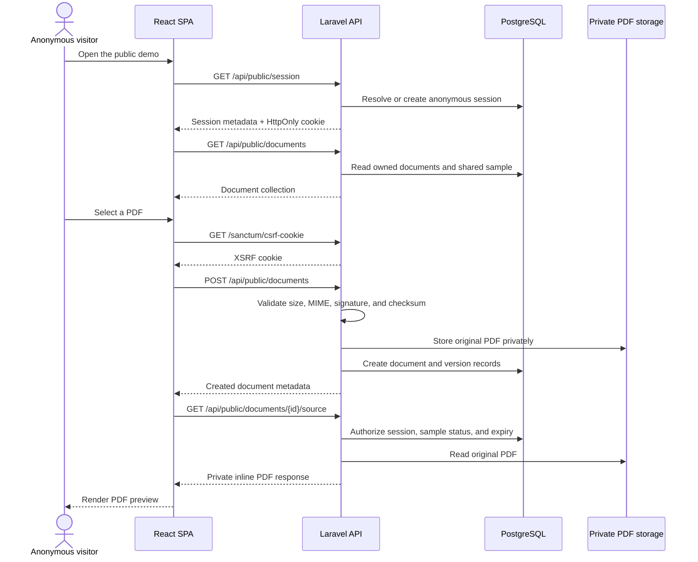
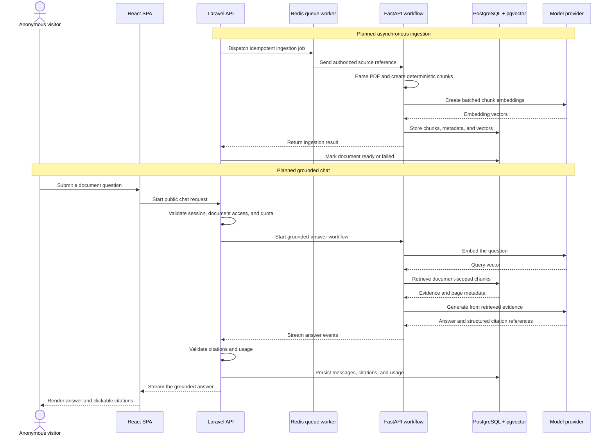

# Architecture and Request Flow

This document describes the public architecture of Support Copilot, the
services in the repository, the implemented HTTP API, and the intended flow
from PDF upload to a grounded answer.

The current implementation covers the repository foundation, the public React
workspace, anonymous sessions, secure PDF upload, private preview, document
ownership, and the administrator API boundary. Document ingestion, retrieval,
and live AI chat are the next delivery stages.

## Repository map

| Path | Responsibility |
|---|---|
| `frontend/` | React and TypeScript single-page application |
| `backend/` | Laravel business API, authorization, storage, queues, and application records |
| `ai-service/` | Private FastAPI service for future parsing, retrieval, and LLM workflows |
| `infrastructure/nginx/` | React production build, static delivery, and PHP-FPM routing |
| `infrastructure/php/` | Laravel PHP-FPM runtime and upload limits |
| `infrastructure/postgres/` | PostgreSQL initialization and pgvector extension setup |
| `infrastructure/ai-service/` | FastAPI container image |
| `compose.yaml` | Local service orchestration, health checks, networking, and persistence |
| `Makefile` | Setup, development, test, lint, migration, and health commands |

Personal plans and operational notes are intentionally excluded from the
repository.

## Runtime services

| Service | Runtime role | Publicly exposed |
|---|---|---|
| `nginx` | Serves the React production bundle and forwards application requests to Laravel | Yes |
| `backend` | Runs Laravel through PHP-FPM | No |
| `queue` | Runs the Laravel Redis queue worker | No |
| `ai-service` | Runs the private FastAPI application | No |
| `postgres` | Stores transactional application data and future vector embeddings | No |
| `redis` | Supports queues, Laravel sessions, cache, and short-lived state | No |

The browser communicates only with Laravel through the same origin. FastAPI,
PostgreSQL, Redis, and model providers are never called directly by the
frontend.

The production React bundle is built into the Nginx image. The optional
`frontend` Compose profile is a development and test tool rather than a
production Node server.

## Development orchestration

For a fresh environment:

```bash
make setup
make up
```

`make setup` prepares the ignored environment file, builds the images, starts
the data dependencies, and runs Laravel migrations. `make up` starts the full
stack in the background and waits for service health checks.

Common commands:

```bash
make dev       # Run the complete stack in the foreground
make up        # Start or refresh the background stack
make down      # Stop services while retaining persistent data
make logs      # Follow application service logs
make health    # Verify Laravel and FastAPI health
make migrate   # Apply Laravel migrations
make test      # Run frontend, backend, and AI-service tests
make lint      # Run static analysis and formatting checks
make config    # Validate the resolved Compose configuration
```

## Storage and data ownership

Uploaded PDFs are stored on a private Laravel filesystem disk. They are not
served by a public storage path. Both the Laravel API and queue worker mount the
same storage directory so a future ingestion job can access the original file.

PostgreSQL is the source of truth for application records. Redis is not a
source of truth; it holds queues, sessions, cache, and temporary state.

The physical PDF key follows this structure:

```text
documents/<anonymous-session-id>/<document-id>/<version-id>.pdf
```

The original display name is stored as metadata rather than used as the
physical filename. This avoids collisions, unsafe path characters, and
untrusted filename handling.

## Implemented HTTP API

All paths below are application paths. The deployed SPA prefixes them with its
configured Vite base path.

### Public document API

| Method | Path | Purpose |
|---|---|---|
| `GET` | `/api/health` | Laravel service health |
| `GET` | `/api/public/session` | Create or refresh an anonymous document session |
| `GET` | `/api/public/documents` | List the current session's documents and any shared sample |
| `POST` | `/api/public/documents` | Upload a PDF into the current anonymous session |
| `GET` | `/api/public/documents/{document}` | Return accessible document metadata |
| `GET` | `/api/public/documents/{document}/source` | Stream the authorized original PDF inline |
| `DELETE` | `/api/public/documents/{document}` | Delete an owned temporary document and its source |
| `GET` | `/sanctum/csrf-cookie` | Initialize same-origin CSRF protection before mutations |

### Administrator API

The Laravel administrator API exists, but the current `Admin preview` screen is
a static product shell and is not connected to authentication yet.

| Method | Path | Purpose |
|---|---|---|
| `POST` | `/api/auth/login` | Start an administrator session |
| `GET` | `/api/auth/me` | Return the authenticated administrator |
| `POST` | `/api/auth/logout` | Invalidate the administrator session |
| `GET` | `/api/admin/documents` | List documents for administration |
| `PATCH` | `/api/admin/documents/{document}/sample` | Enable or disable a ready document as the shared sample |
| `DELETE` | `/api/admin/documents/{document}` | Delete a document, its sources, and record an audit event |
| `GET` | `/api/admin/conversations` | List conversations when public chat becomes available |
| `GET` | `/api/admin/usage` | Aggregate request, token, and estimated-cost records |

All protected authentication and administrator routes require both Sanctum
authentication and administrator authorization.

### Private FastAPI API

| Method | Path | Status |
|---|---|---|
| `GET` | `/health` | Implemented for internal health checks |

Parsing, retrieval, and generation endpoints have not been implemented or
named yet.

## Current anonymous visitor flow

There is no separate landing page. The public demo opens directly into the
upload-first workspace.



### Session initialization

1. React calls `GET /api/public/session` when the workspace loads.
2. Laravel resolves the opaque demo cookie. If it is missing or expired,
   Laravel creates a new random token and stores only its SHA-256 hash.
3. React calls `GET /api/public/documents` to restore the visitor's most recent
   private document or the shared sample document.

### PDF upload

1. React performs an early PDF and 10 MB size check for fast feedback.
2. React initializes CSRF protection through Sanctum.
3. The browser sends the PDF as multipart field `file` to
   `POST /api/public/documents`.
4. Laravel verifies the anonymous session, upload status, detected MIME type,
   `%PDF-` signature, and configured size limit.
5. Laravel calculates a SHA-256 checksum. A matching source in the same session
   is reused instead of stored again.
6. A new upload creates a `documents` record with `pending_ingestion` status and
   a version record with `pending` ingestion status.
7. The endpoint returns `201 Created` for a new document or `200 OK` with
   `meta.duplicate = true` for a reusable duplicate.

No Python, embedding, vector retrieval, or LLM call occurs during the current
upload flow.

### Private preview

React embeds `GET /api/public/documents/{document}/source`. Laravel authorizes
the current anonymous session or shared-sample boundary, rejects expired
documents, and returns the original PDF with private, no-store caching headers.

The current preview is the raw original PDF. OCR, processed blocks, and
citation highlighting are not implemented yet.

### Document removal

React initializes CSRF protection and calls
`DELETE /api/public/documents/{document}` after visitor confirmation. Laravel
requires exact ownership, soft-deletes the document record, and deletes the
physical source. Anonymous visitors cannot delete the shared sample.

## Planned ingestion and grounded-answer flow

The following sequence describes the intended component boundary. The missing
routes are deliberately left unnamed until their implementation establishes a
tested API contract.



### API contracts not implemented yet

| Capability | Endpoint | Status |
|---|---|---|
| Queue ingestion after upload | To be defined | Planned |
| Laravel-to-FastAPI ingestion request | To be defined | Planned |
| Parsed block and chunk inspection | To be defined | Planned |
| Retrieval inspection | To be defined | Planned |
| Public conversation creation and history | To be defined | Planned |
| Streaming question and answer | To be defined | Planned |
| FastAPI grounded generation | To be defined | Planned |
| Answer feedback | To be defined | Planned |
| Human handoff | To be defined | Planned |
| Public quota and access-pass redemption | To be defined | Planned |

## Data created by stage

| Stage | Current data | Planned AI data |
|---|---|---|
| Open demo | Anonymous session | None |
| Upload PDF | Private source, document, and document version | None |
| Ingestion | Not implemented | Ingestion operation, normalized blocks, chunks, and vectors |
| Ask question | Not implemented | Conversation and user message |
| Generate answer | Not implemented | Assistant message, citations, usage, latency, and estimated cost |
| Feedback and handoff | Not implemented | Feedback and conversation support state |

## Current implementation boundary

Implemented:

- React upload-first public workspace
- Anonymous document sessions
- Secure PDF validation and upload
- Private source storage and authorized inline preview
- Document and version records with checksum-based duplicate handling
- Session-scoped list, show, preview, and delete operations
- Administrator Laravel API boundary
- Static administrator product preview
- Docker health checks and automated frontend, backend, and AI-service tests

Planned:

- Administrator login UI
- Asynchronous ingestion job
- PDF parsing and optional OCR
- Deterministic chunking and embeddings
- pgvector retrieval and evaluation
- Grounded answer generation and safe fallback
- Streaming chat persistence
- Validated citations and PDF reference highlighting
- Public quota, access passes, feedback, and human handoff
