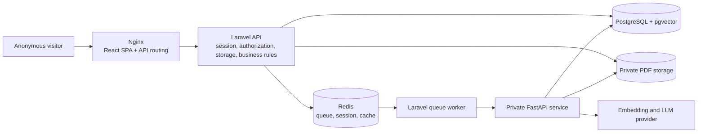
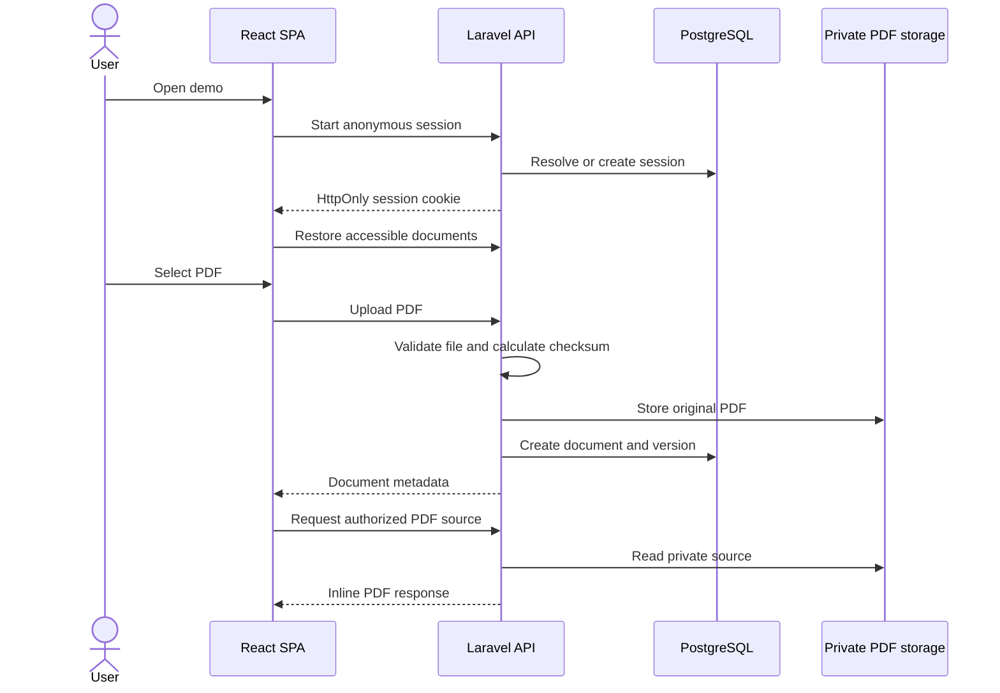
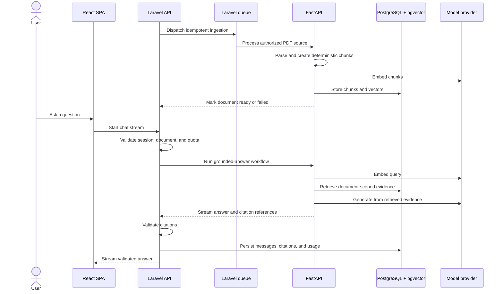

# Architecture

Support Copilot uses Laravel as the only public business API and keeps the AI
workflow behind a private FastAPI service.

## Components

The browser never calls FastAPI, PostgreSQL, Redis, or a model provider
directly.

## Repository boundaries

| Path | Responsibility |
|---|---|
| `frontend/` | React and TypeScript SPA |
| `backend/` | Laravel API and queue code |
| `ai-service/` | Private document-processing and RAG service |
| `infrastructure/nginx/` | Static SPA delivery and PHP-FPM routing |
| `infrastructure/php/` | Laravel PHP-FPM image |
| `infrastructure/postgres/` | PostgreSQL and pgvector initialization |
| `infrastructure/ai-service/` | FastAPI image |
| `compose.yaml` | Service orchestration and persistence |

## Current upload flow

The current upload ends with `pending_ingestion`. No Python, embedding, vector
retrieval, or LLM call occurs yet.

## Planned RAG flow

See [API Reference](API.md) for the concrete implemented endpoints and planned
API gaps.
