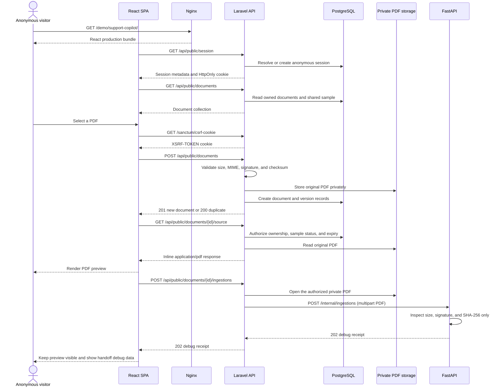
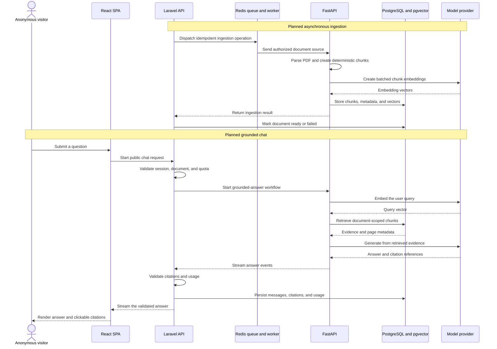

# Services and Request Flow

This document describes the current Support Copilot service boundaries, startup
commands, implemented endpoints, and the request flow from an anonymous visit
through PDF upload and preview. Future endpoints are explicitly marked as not
implemented and should not be treated as established API contracts.

## 1. Runtime boundary

The browser-facing production base path is:

```text
/demo/support-copilot/
```

There is no separate landing page. Opening the demo renders the upload-first
workspace directly, with a source panel and a chat panel.

The application boundary is:

```text
Browser
  -> reverse proxy
  -> Support Copilot Nginx
       -> React production files
       -> Laravel API through PHP-FPM
```

Only Nginx is exposed publicly. FastAPI, PostgreSQL, and Redis remain on the
private application network.

## 2. Repository and service map

| Service or component | Repository path | Current responsibility |
|---|---|---|
| React SPA | `frontend/` | Public upload workspace, PDF preview, and static admin preview |
| Laravel API | `backend/` | Anonymous sessions, authorization, PDF lifecycle, admin API, and application records |
| Laravel queue worker | Shared code in `backend/` | Runs the Redis worker; no ingestion job exists yet |
| FastAPI AI service | `ai-service/` | Receives an internal PDF handoff and returns debug metadata; parsing, RAG, and LLM workflows are not implemented |
| Nginx | `infrastructure/nginx/` | Builds and serves the React bundle and forwards `/api/*` and `/sanctum/*` to PHP-FPM |
| PHP-FPM image | `infrastructure/php/` | Laravel runtime and file-upload limits |
| PostgreSQL initialization | `infrastructure/postgres/` | Enables pgvector; Laravel migrations manage application tables |
| FastAPI image | `infrastructure/ai-service/` | Builds the Python and FastAPI runtime |
| Docker orchestration | `compose.yaml` | Declares services, networking, health checks, mounts, and persistent volumes |
| Developer commands | `Makefile` | Setup, start, stop, test, lint, migrate, and health commands |
| Environment bootstrap | `scripts/prepare-env.sh` | Creates an ignored `.env` file and generates a Laravel application key when needed |
| Private uploaded PDFs | `backend/storage/app/private/documents/` | Shared storage for the Laravel API and queue worker |

### Compose services

| Compose service | Runtime | Publicly exposed | Persistence |
|---|---|---:|---|
| `nginx` | Nginx and React production build | Yes | Stateless |
| `backend` | PHP-FPM and Laravel | No | Shared private PDF mount |
| `queue` | Laravel queue worker | No | Shared private PDF mount |
| `ai-service` | Uvicorn and FastAPI | Development loopback only | No application state yet |
| `postgres` | PostgreSQL and pgvector | No | `postgres_data` named volume |
| `redis` | Redis with AOF | No | `redis_data` named volume |
| `frontend` | Optional Vite tool container | No | `frontend_node_modules` named volume |

The optional `frontend` Compose profile supports development and tests. In the
default stack, React is built into the Nginx image and served as static files;
there is no production Node server handling browser requests.

## 3. Starting and operating the project

Run commands from the repository root.

### Fresh setup

```bash
make setup
make up
```

`make setup`:

1. Creates `.env` from `.env.example` when missing.
2. Generates a local Laravel `APP_KEY`.
3. Builds the container images.
4. Starts PostgreSQL and Redis.
5. Runs Laravel migrations.

`make up` starts the complete stack in the background and waits for service
health checks.

### Start an existing environment

```bash
make up
```

Equivalent Compose command:

```bash
docker compose up -d --build --wait
```

### Run in the foreground

```bash
make dev
```

### Common operations

```bash
make health     # Verify Laravel and FastAPI health
make logs       # Follow Nginx, Laravel, queue, and FastAPI logs
make migrate    # Apply Laravel migrations
make test       # Run frontend, backend, and AI-service tests
make lint       # Run lint and formatting checks
make config     # Validate the resolved Compose configuration
make down       # Stop services while retaining persistent data
```

`docker compose down -v` intentionally removes named volumes and should only be
used when resetting persistent PostgreSQL and Redis data.

## 4. Browser paths and application paths

The SPA is deployed below a nested base path. For example:

```text
Browser path:     /demo/support-copilot/api/public/session
Application path: /api/public/session
```

The browser path includes the configured Vite base. The reverse proxy removes
that prefix before Laravel handles the application route.

The route definitions are in
[`backend/routes/api.php`](backend/routes/api.php). The current React API client
is in [`frontend/src/api.ts`](frontend/src/api.ts).

## 5. Implemented endpoints

### 5.1 Public anonymous document API

| Method | Browser path | Application path | Purpose |
|---|---|---|---|
| `GET` | `/demo/support-copilot/api/health` | `/api/health` | Laravel health check |
| `GET` | `/demo/support-copilot/api/public/session` | `/api/public/session` | Create or refresh an anonymous session cookie |
| `GET` | `/demo/support-copilot/api/public/documents` | `/api/public/documents` | List documents owned by the current session and the shared sample |
| `POST` | `/demo/support-copilot/api/public/documents` | `/api/public/documents` | Upload a PDF |
| `GET` | `/demo/support-copilot/api/public/documents/{document}` | `/api/public/documents/{document}` | Return authorized document metadata |
| `GET` | `/demo/support-copilot/api/public/documents/{document}/source` | `/api/public/documents/{document}/source` | Stream the authorized original PDF inline |
| `DELETE` | `/demo/support-copilot/api/public/documents/{document}` | `/api/public/documents/{document}` | Delete an owned document and its source |
| `POST` | `/demo/support-copilot/api/public/documents/{document}/ingestions` | `/api/public/documents/{document}/ingestions` | Send an owned PDF to the internal AI service |
| `GET` | `/demo/support-copilot/sanctum/csrf-cookie` | `/sanctum/csrf-cookie` | Initialize Sanctum CSRF protection before mutations |

#### Upload request

```http
POST /api/public/documents
Accept: application/json
Content-Type: multipart/form-data
X-XSRF-TOKEN: <token from the XSRF-TOKEN cookie>

file=<PDF binary>
```

Upload requirements:

- A valid anonymous session cookie
- Multipart field name `file`
- PDF only
- Maximum size 10 MB
- Detected MIME type `application/pdf`
- File content starts with `%PDF-`

A new upload returns `201 Created`. An identical source already available in
the same anonymous session returns the existing document with `200 OK` and
`meta.duplicate = true`.

#### Ingestion handoff request

The browser sends an empty, CSRF-protected `POST` to Laravel after upload. It
does not send the PDF to FastAPI directly:

```http
POST /api/public/documents/{document}/ingestions
Accept: application/json
X-XSRF-TOKEN: <token from the XSRF-TOKEN cookie>
```

After ownership checks, Laravel sends this internal multipart request:

```text
file=<authorized PDF binary>
document_version_id=<document_versions.id>
checksum=<document_versions.content_checksum>
```

The current response is a development receipt containing filename, byte size,
PDF signature, calculated SHA-256, and whether it matches Laravel's checksum.

### 5.2 Administrator API

The Laravel endpoints below exist, but the React `Admin preview` is still a
static product shell. It does not yet provide a login screen or call these
routes.

| Method | Application path | Purpose |
|---|---|---|
| `POST` | `/api/auth/login` | Start an administrator session |
| `GET` | `/api/auth/me` | Return the authenticated administrator |
| `POST` | `/api/auth/logout` | Invalidate the administrator session |
| `GET` | `/api/admin/documents` | List up to 50 documents |
| `PATCH` | `/api/admin/documents/{document}/sample` | Enable or disable a ready shared sample |
| `DELETE` | `/api/admin/documents/{document}` | Delete a document, remove its source, and create an audit event |
| `GET` | `/api/admin/conversations` | List conversations when public chat data exists |
| `GET` | `/api/admin/usage` | Aggregate request, token, and estimated-cost data |

Except for login, all authentication and administrator endpoints require
Sanctum authentication and administrator authorization.

### 5.3 Private FastAPI API

| Method | Internal path | Status |
|---|---|---|
| `GET` | `/health` | Implemented for internal health checks |
| `POST` | `/internal/ingestions` | Receives multipart PDF data and returns a debug receipt; no processing or persistence yet |

FastAPI is not exposed through the public application. Its Swagger UI is
available on a development-only loopback listener at `/docs`. Parsing,
retrieval, and generation routes have not been implemented or named.

## 6. Current guest flow



### 6.1 Opening the demo

1. The base path returns the React application.
2. React calls `GET /api/public/session`.
3. Laravel reads the opaque demo cookie:
   - a valid cookie refreshes the session activity and expiry;
   - a missing or expired cookie creates a random token and stores only its
     SHA-256 hash.
4. Laravel returns an HttpOnly cookie.
5. React calls `GET /api/public/documents` to restore a private document or the
   shared sample.
6. The frontend prefers the newest private document before falling back to the
   shared sample.

### 6.2 Uploading a PDF

1. React performs an early file type and 10 MB size check.
2. React requests `/sanctum/csrf-cookie` and sends `X-XSRF-TOKEN` with the
   mutation.
3. React sends multipart field `file` to `POST /api/public/documents`.
4. Laravel requires a valid anonymous session.
5. Laravel validates the upload, detected MIME type, PDF signature, and size.
6. Laravel calculates a SHA-256 checksum. Identical content in the same session
   reuses the existing document if its source remains available.
7. A new source is stored at:

   ```text
   backend/storage/app/private/documents/<session-id>/<document-id>/<version-id>.pdf
   ```

8. Laravel creates:
   - a `documents` record with `pending_ingestion` status;
   - a version 1 `document_versions` record with `pending` ingestion status.
9. This first request returns before any Python call, so the PDF preview can be
   rendered immediately.

### 6.3 Handing the PDF to FastAPI

1. After upload succeeds, React starts a separate
   `POST /api/public/documents/{document}/ingestions` request.
2. The preview remains available while the second request is in progress.
3. Laravel verifies exact anonymous-session ownership, opens the private PDF,
   and sends it to `POST /internal/ingestions` as multipart data with the
   document-version ID and Laravel checksum.
4. FastAPI reads the source in bounded blocks, verifies the `%PDF-` signature,
   calculates SHA-256, and returns a `202 Accepted` debug receipt.
5. FastAPI does not store the source and does not parse, chunk, embed, or call a
   model in this slice.
6. Laravel does not change `pending_ingestion` or `pending`; the UI shows the
   receipt while chat remains locked.

### 6.4 Previewing a PDF

1. React renders an iframe using
   `GET /api/public/documents/{document}/source`.
2. Laravel permits a document owned by the current anonymous session or a
   non-expired shared sample.
3. Laravel reads the private source and returns an inline PDF with
   `Cache-Control: private, no-store`.
4. The browser displays the raw original PDF. Processed blocks, OCR, and
   citation highlighting do not exist yet.

### 6.5 Deleting a PDF

1. React asks for confirmation.
2. React initializes CSRF protection and calls
   `DELETE /api/public/documents/{document}`.
3. Laravel requires exact ownership; a guest cannot delete the shared sample.
4. Laravel soft-deletes the document record and deletes the physical source.
5. React returns to the empty upload state.

### 6.6 Asking a question today

An uploaded document remains `pending_ingestion`, so the chat composer stays
locked and displays `Awaiting ingestion`.

The current application does not yet:

- expose a public chat endpoint;
- create conversations or messages;
- parse or persist document content in FastAPI;
- create query or chunk embeddings;
- query pgvector;
- call an answer model;
- stream an answer; or
- create or highlight citations.

## 7. Planned ingestion and grounded-answer flow

This sequence describes the intended service boundary, not an implemented API
contract.



### Missing endpoints

| Capability | Public or internal endpoint | Status |
|---|---|---|
| Parsed block and chunk inspection | — | Not implemented |
| Retrieval inspection | — | Not implemented |
| Create or continue a public conversation | — | Not implemented |
| Submit a question and receive a stream | — | API and event contract not defined |
| FastAPI grounded generation | — | Not implemented |
| Restore conversation history | — | Not implemented |
| Submit answer feedback | — | Not implemented |
| Request human handoff | — | Not implemented |
| Redeem an access pass | — | Not implemented |
| Enforce public and access-pass quota | — | Not implemented |

Route names will be defined with their implementation to avoid publishing an
untested contract. The browser will continue to communicate only with Laravel;
FastAPI and model providers remain private.

## 8. Data created by stage

| Stage | Current file or database data | Planned AI data |
|---|---|---|
| Open demo | `anonymous_sessions` | None |
| Upload PDF | Private PDF, `documents`, and `document_versions` | None |
| Ingestion handoff | FastAPI debug receipt only; not persisted | Normalized blocks, `chunks`, and vectors |
| Ask question | Not implemented | `conversations` and user `messages` |
| Generate answer | Not implemented | Assistant `messages`, `message_citations`, and `usage_events` |
| Feedback and handoff | Not implemented | Feedback and conversation support state |

PostgreSQL is the source of truth for application data. The original PDF is
stored on a private Laravel filesystem disk. Redis stores queues, Laravel
sessions, cache, and short-lived state; it is not a source of truth.

## 9. Current implementation snapshot

```text
Implemented
  React upload-first workspace
  anonymous session
  secure PDF upload
  private PDF storage
  document and version metadata
  authorized list, show, preview, and delete
  separate Laravel-to-FastAPI PDF handoff
  FastAPI Swagger and ingestion debug receipt
  static administrator preview
  protected administrator Laravel API

Not implemented
  administrator login UI
  asynchronous ingestion queue job
  PDF parser and OCR
  chunking
  embeddings
  pgvector retrieval
  grounded generation
  streaming chat
  citations and PDF highlighting
  quota and access passes
  feedback and human handoff
```
